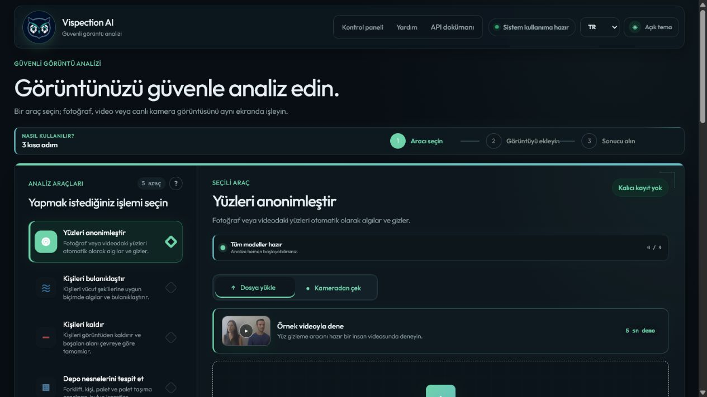
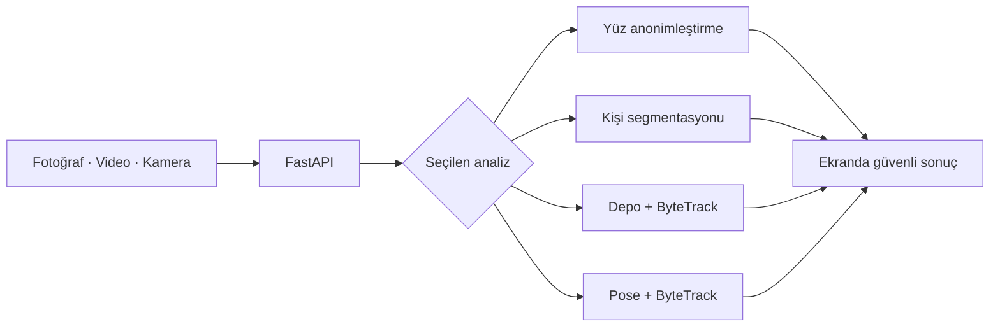

<div align="center">
  

  # Privacy Vision AI

  **KVKK odaklı, gerçek zamanlı insan, yüz gizliliği ve depo görüntü analizi**

  Fotoğraf, video ve canlı kamera görüntülerini tek bir modern arayüzden analiz edin.

  [](https://www.python.org/)
  [](https://fastapi.tiangolo.com/)
  [](https://docs.ultralytics.com/)
  [](#testler)

  [Hızlı başlangıç](#hızlı-başlangıç) · [Özellikler](#özellikler) · [API](#api-kullanımı) · [Testler](#testler)
</div>

---



## Özellikler

| Araç | Ne yapar? | Girdi |
|---|---|---|
| 🛡️ **Yüzleri anonimleştir** | Birden fazla yüzü doğal bulanıklaştırma, mozaik veya renk kalkanıyla gizler. | Fotoğraf, video, kamera |
| 🌊 **Kişileri bulanıklaştır** | Segmentasyon maskeleriyle yalnızca insanları bulanıklaştırır. | Fotoğraf, video, kamera |
| ✨ **Kişileri kaldır** | Birden fazla kişiyi algılar ve boşalan alanı çevreye göre tamamlar. | Fotoğraf, video, kamera |
| 🏭 **Depo analizi** | Forklift, insan ve paletleri algılar; ByteTrack ile kimliklerini korur. | Fotoğraf, video, kamera |
| 🦴 **Vücut duruşu analizi** | Birden fazla kişinin 17 eklem noktasını çizer ve geçişlerde takip eder. | Fotoğraf, video, kamera |

### Kullanıcı deneyimi

- Türkçe ve İngilizce arayüz
- Açık/koyu tema ve temaya uyumlu maskot
- Ön/arka kamera seçimi
- Canlı FPS, gecikme ve atlanan kare bilgisi
- Video için gerçek yüzde ve kare ilerlemesi
- İşleme göre açılan bağlamsal seçenekler
- Hazır, birbirinden ayrı kısa demo videoları
- El hareketleriyle canlı yüz gizlemeyi açma, kapatma ve mod değiştirme

## Nasıl çalışır?



Web API katmanı, depodaki mevcut analiz bileşenlerini servis olarak kullanır. Yüz takibi, kişi segmentasyonu, forklift tespiti ve pose modelleri birbirinden bağımsız yüklenir.

## Hızlı başlangıç

### 1. Ortamı oluşturun

Windows PowerShell’de proje klasöründe:

```powershell
python -m venv .venv-api
Set-ExecutionPolicy -Scope Process -ExecutionPolicy RemoteSigned
.\.venv-api\Scripts\Activate.ps1
python -m pip install -r requirements-api.txt
```

### 2. Sunucuyu çalıştırın

```powershell
python -m uvicorn api.main:app --reload --port 8000
```

| Adres | Açıklama |
|---|---|
| `http://127.0.0.1:8000` | Web arayüzü |
| `http://127.0.0.1:8000/docs` | Swagger API dokümanı |
| `http://127.0.0.1:8000/redoc` | ReDoc API dokümanı |

`WinError 10013` veya port kullanım hatasında farklı bir port seçin:

```powershell
python -m uvicorn api.main:app --reload --port 8001
```

## Gerekli model dosyaları

```text
blur_and_segment/yolov8n-face.pt
blur_and_segment/yolo11s-seg.pt
blur_and_segment/yolo11n-pose.pt
FORKLIFT DETECTION/models/forklift_yolo11s_multivideo_best.pt
```

> Modeller ilk istekten önce arka planda hazırlanır. Sanal ortamlar, çalışma çıktıları ve veri setleri `.gitignore` ile GitHub dışında tutulur.

## Demo videoları

Her araç kendi kısa H.264 demosunu kullanır:

- [Yüz anonimleştirme demosu](api/static/samples/face-privacy-demo.mp4)
- [Kişi bulanıklaştırma demosu](api/static/samples/people-blur-demo.mp4)
- [Kişi kaldırma demosu](api/static/samples/people-remove-demo.mp4)
- [Depo analizi demosu](api/static/samples/warehouse-demo.mp4)
- [Çoklu kişi pose demosu](api/static/samples/multi-person-pose-demo.mp4)

## API kullanımı

Örnek bir fotoğraftaki yüzleri anonimleştirme:

```powershell
curl.exe -X POST `
  "http://127.0.0.1:8000/api/v1/privacy/anonymize?mode=soft_blur&confidence=0.30" `
  -F "file=@ornek.jpg" `
  --output sonuc.jpg
```

Başlıca uçlar:

| Metot | Uç | İşlem |
|---|---|---|
| `POST` | `/api/v1/privacy/anonymize` | Fotoğraf yüz anonimleştirme |
| `POST` | `/api/v1/privacy/live` | Takipli canlı yüz anonimleştirme |
| `POST` | `/api/v1/people/process` | Kişi bulanıklaştırma/kaldırma |
| `POST` | `/api/v1/forklift/detect` | Depo nesnelerini algılama |
| `POST` | `/api/v1/pose/estimate` | Vücut duruşu analizi |
| `POST` | `/api/v1/jobs/video` | İlerleme bilgili video işi |

## Testler

Hızlı birim ve API testleri:

```powershell
python -m pytest api/tests -q
```

Gerçek modeller ve örnek videolarla uçtan uca test:

```powershell
$env:RUN_MODEL_E2E="1"
python -m pytest api/tests/test_video_demos_e2e.py -q
```

Son doğrulama sonucu: **42 birim/API testi + 5 gerçek model video testi başarılı.**

## Proje yapısı

```text
api/                    FastAPI uçları, servisler, testler ve web arayüzü
blur_and_segment/       Yüz modeli, kişi segmentasyonu ve pose modelleri
FORKLIFT DETECTION/     Forklift modeli, ByteTrack ayarı ve eğitim araçları
realtime_pipeline/      Gerçek zamanlı yüz takip ve gizlilik bileşenleri
face-blur-and-tracking/ Video yüz bulanıklaştırma ve takip bileşenleri
privacy_human_analysis/ Veri hazırlama ve eğitim çalışmaları
```

## GitHub Desktop kontrol listesi

1. GitHub Desktop’ta **Changes** bölümünde kaynak kodları, `README.md`, `SECURITY.md`, `docs/`, gerekli model dosyaları ve demo videolarını seçin.
2. `.venv`, `.venv-api`, `.runtime`, `.env`, veri setleri ve eğitim çıktıları görünmemelidir; bunlar `.gitignore` ile dışarıda tutulur.
3. Commit açıklaması olarak örneğin `Complete secure visual analysis web API` yazın.
4. Önce **Commit to main**, ardından **Push origin** düğmesini kullanın.

> Gerçek anahtarınızı `.env` içinde tutun. `.env.example` yalnızca güvenli örnek ayarları içerir.

## Gizlilik

Ham yüklemeler kalıcı kullanıcı arşivi olarak tutulmaz; geçici iş dosyaları süre sonunda temizlenir. Bu proje tek başına hukuki uygunluk veya iş güvenliği sertifikası sağlamaz. Üretim ortamında erişim kontrolü, saklama süresi, log politikası ve KVKK süreçleri ayrıca değerlendirilmelidir.

## Güvenlik özeti

- Dosya türü yalnızca tarayıcının bildirdiği MIME değerine göre değil, gerçek içerik ve video metadatasıyla da doğrulanır.
- Yükleme boyutu, görüntü çözünürlüğü, video çözünürlüğü ve video süresi sınırlandırılır.
- Geçici dosyalar rastgele adlandırılır; API sonuçları tarayıcı önbelleğine alınmaz.
- İstek hızı ve eşzamanlı video işi sayısı sınırlandırılır.
- İnternete açık kullanım için `API_KEY` etkinleştirilebilir.

Ayarlar ve üretim notları için [SECURITY.md](SECURITY.md) ve [.env.example](.env.example) dosyalarına bakın.

---

<div align="center">
  <strong>Privacy Vision AI</strong><br />
  Rana Yalçın tarafından güvenli görüntü analizi için geliştirildi.
</div>
