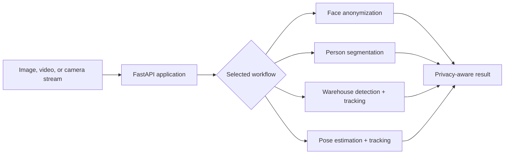

# Privacy Vision AI

Privacy Vision AI is a KVKK-aware computer-vision platform for privacy-preserving analysis of images, videos, and live camera streams. It combines face anonymization, person privacy tools, pose tracking, and warehouse analytics behind a FastAPI service and browser-based interface.

> This project is a technical implementation. It does not itself constitute legal advice, KVKK compliance certification, or workplace-safety certification.

## Key capabilities

| Area | Capabilities |
| --- | --- |
| Face privacy | Multi-face detection and anonymization with soft blur, mosaic, and color-mask modes. |
| Person privacy | Human segmentation for person blurring and person removal. |
| Live processing | Camera input, tracked face anonymization, frame queues, and live performance metrics. |
| Pose analysis | Multi-person pose estimation with 17 keypoints and identity tracking. |
| Warehouse analytics | Forklift, person, and pallet detection with ByteTrack-based object tracking. |
| Secure delivery | File-content validation, size and duration limits, temporary-file cleanup, rate limiting, and optional API-key protection. |

## Architecture



The API layer loads the relevant vision components independently, so face privacy, segmentation, warehouse detection, and pose analysis can be used as separate workflows.

## Quick start

### 1. Create a Python environment

From the project root in PowerShell:

```powershell
python -m venv .venv-api
.\.venv-api\Scripts\Activate.ps1
python -m pip install --upgrade pip
python -m pip install -r requirements-api.txt
```

### 2. Run the application

```powershell
python -m uvicorn api.main:app --reload --port 8000
```

| URL | Purpose |
| --- | --- |
| `http://127.0.0.1:8000` | Web interface |
| `http://127.0.0.1:8000/docs` | Interactive OpenAPI documentation |
| `http://127.0.0.1:8000/redoc` | ReDoc documentation |

If port `8000` is unavailable, choose another port, for example `8001`.

## Model assets

The repository includes the model files required by the main workflows:

```text
blur_and_segment/yolov8n-face.pt
blur_and_segment/yolo11s-seg.pt
blur_and_segment/yolo11n-pose.pt
FORKLIFT DETECTION/models/forklift_yolo11s_multivideo_best.pt
```

Models are loaded on demand. Do not commit private datasets, inference outputs, environment files, or credentials; the included `.gitignore` excludes these local artifacts.

## API examples

Anonymize faces in an image:

```powershell
curl.exe -X POST `
  "http://127.0.0.1:8000/api/v1/privacy/anonymize?mode=soft_blur&confidence=0.30" `
  -F "file=@example.jpg" `
  --output anonymized.jpg
```

| Method | Endpoint | Description |
| --- | --- | --- |
| `POST` | `/api/v1/privacy/anonymize` | Face anonymization for images. |
| `POST` | `/api/v1/privacy/live` | Tracked face anonymization for live frames. |
| `POST` | `/api/v1/people/process` | Person blurring or removal. |
| `POST` | `/api/v1/forklift/detect` | Warehouse object detection. |
| `POST` | `/api/v1/pose/estimate` | Multi-person pose estimation. |
| `POST` | `/api/v1/jobs/video` | Video jobs with progress reporting. |

## Testing

Run the unit and API test suite:

```powershell
python -m pytest api/tests -q
```

Optional end-to-end video tests use real models and demo media:

```powershell
$env:RUN_MODEL_E2E="1"
python -m pytest api/tests/test_video_demos_e2e.py -q
```

## Repository structure

```text
api/                       FastAPI routes, services, tests, and web UI
blur_and_segment/          Face, segmentation, and pose workflows
FORKLIFT DETECTION/        Warehouse model, tracking configuration, and tooling
realtime_pipeline/         Real-time privacy and hand-control components
face-blur-and-tracking/    Original face-blur and tracking modules
privacy_human_analysis/    Dataset-preparation and training utilities
docs/                      Project documentation and interface screenshots
```

## Security and privacy

The application implements practical safeguards including MIME and content validation, upload limits, randomized temporary filenames, cleanup of expired jobs, no-store response headers, rate limits, concurrency limits, and optional API-key authentication.

For an internet-facing deployment, configure HTTPS, access control, malware scanning, retention policies, observability, and a KVKK review appropriate to the deployment context. See [SECURITY.md](SECURITY.md) and [.env.example](.env.example) for configuration guidance.

## License

No license has been selected yet. Do not reuse or redistribute the code, model assets, or documentation beyond the permissions granted by the repository owner until a license is added.
