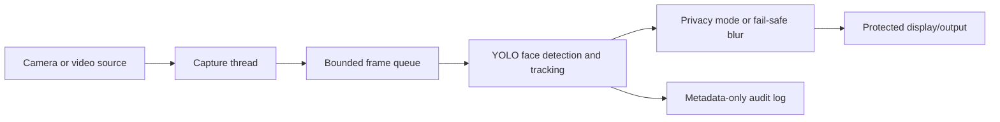

# System Architecture

The queue is bounded so that delayed processing does not create an unlimited
backlog. The original frame exists only in memory during processing. The
audit branch receives metadata and never receives pixel arrays.
